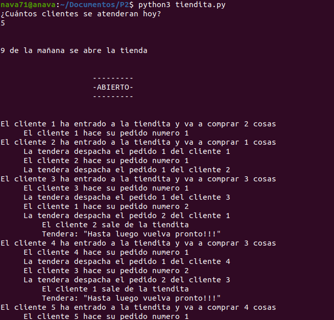
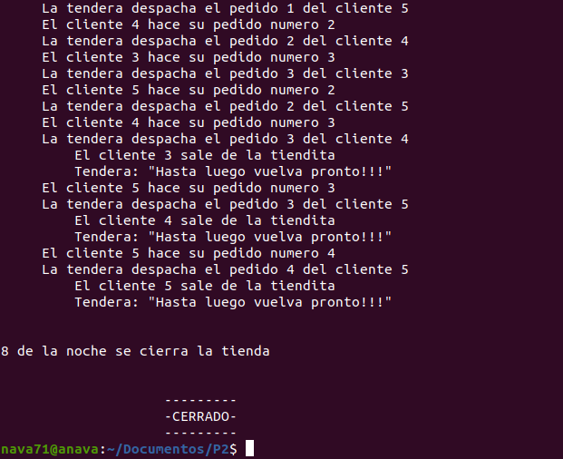

#Proyecto 2 Una situación cotidiana paralelizable##
##Nava Escobar Jose Alfredo###

Documentación del proyecto 2 de la materia de Sistemas Operativos

##Identificación y descripción del problema##

Para este proyecto no se me ocurría que situación se podia representar, así que fuí a la tienda por algo que comer  mientras pensaba y me di cuenta que una tienda era un perfecto ejemplo.

En la tienda donde usualmente compro, la tendera despacha no precisamente en orden, es decir si alguien llega la atiende de inmediato pero si va a comprar más de un artículo y duda o piensa de más que más va a comprar, la tendera le dirá a la persona que llego despues "¿Qué va a llevar?" saltando al cliente que ya atendia para que pueda pensar y evitando que los siguientes clientes pierdan su tiempo.

Por motivo de la contingencia que vivimos actualmente la señora ha colocado una hoja que tiene escrito "Sólo se permiten 3 personas en la tienda y con cubrebocas puesto". Debido ha esto la clientela tendra que esperar si ya hay tres clientes dentro de la tiendita, aunque mientras yo era atendido y ya eramos 3 personas, un señor ingresó a la tienda.  

##Mecanismos para resolver el problema##
Para la solución, se ejecuta un hilo para la tendera y uno para cada cliente, cada cliente es asociado a un identificador y tiene un máximo de artículos a comprar de 5, el proceso de pedidos por cliente se maneja en una lista.

Cada cliente puede hacer un pedido a la vez y la tendera puede pasar con otro cliente si es que hay más esperando en la tienda.

Los mecanismos empleados fueron: **mutex**, **multiplex** y **señalización**

Se crearón 4 semaforos los cuales permitén la cominicación entre la tendera y los clientes.

Debido a que solo puede haber 3 personas dentro de la tienda se empleó un multiplex, que controla que no entre más gente.

##Entorno de desarrollo##
El programa fue escrito en el lenguaje de programación Python en su version 3.8.5. en un sistema operativo tipo ***UNIX***, Ubuntu 20.04.1 LTS para ser exactos.

Para la realizacón del programa se utilizarón las bibliotecas **threading**, **time** y **random**

    from threading import Semaphore, Thread
    from time import sleep 
    from random import randint

##Ejecución##
Para ejecutar el programa basta con escribir en la terminal (estando en el directorio donde esta el documento claro):

		$python3 tiendita.py

##Ejemplo de una ejecución existosa##
Pantallazos de ejecución exitosa

